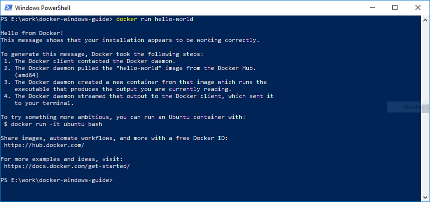
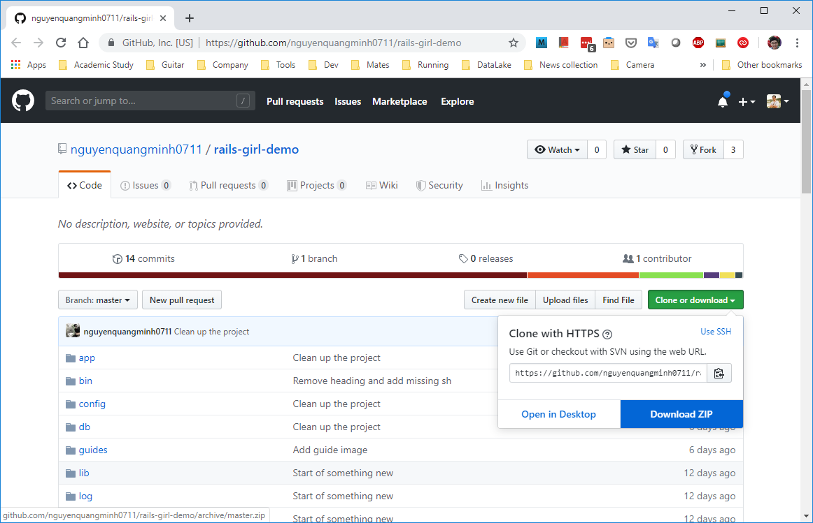
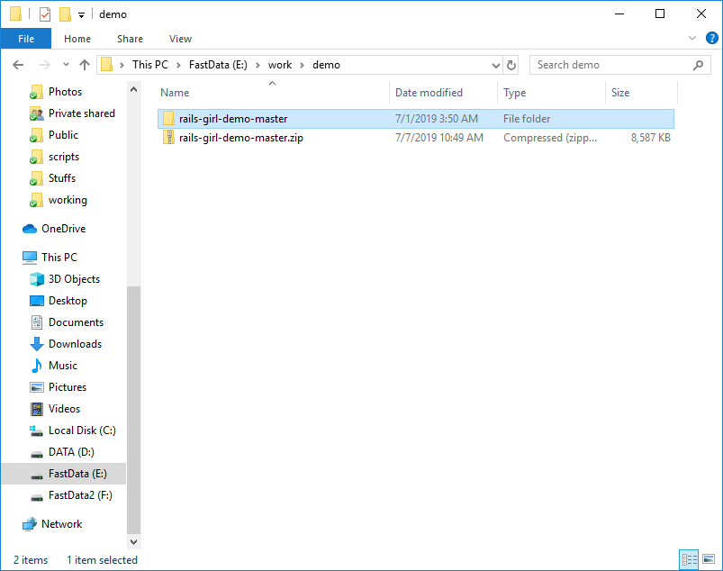
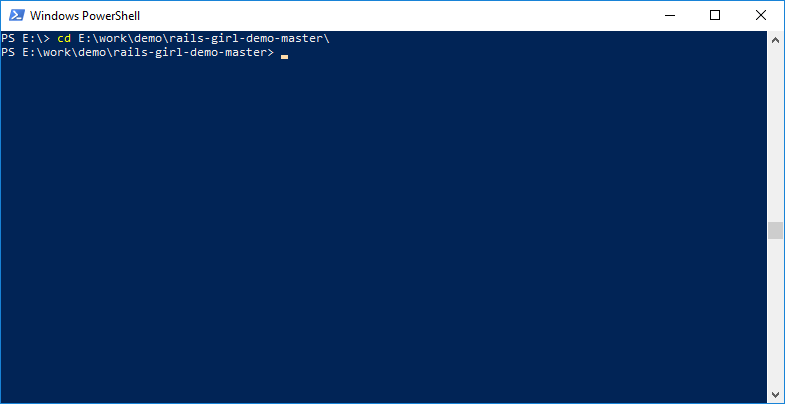
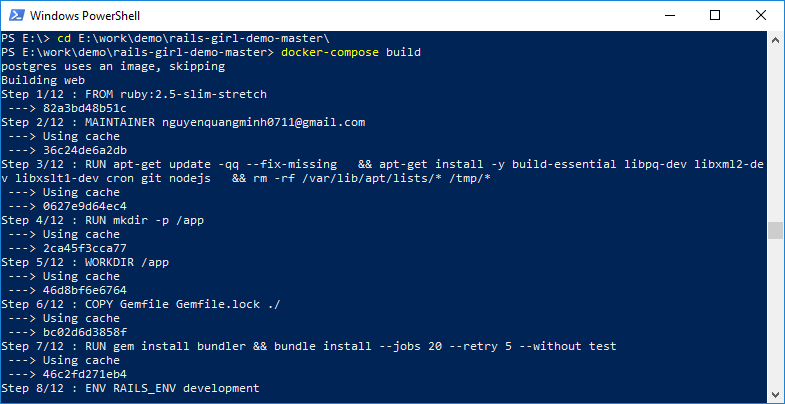

# Docker For Windows
## Installation
Follow instructions from [Docker main page][1] 

**NOTE**: Docker for Windows requires:
- Windows 10 Pro or above
- [Hyper-V virtualization is enable][2]. Some machines are not enable it be default in bios settings, so maybe we have to boot to bios to make it on, checkout [here][3] for more details. Remain steps can be done automatically by Docker for Windows.

## Post Installation
### Verify Docker is running
See the Docker icon in the notification area

![Docker icon running][docker_icon]

### Interact with Docker through PowerShell
Open PowerShell terminal (Press Windows key and type "powershell" to find it).
Then type following command to verify Docker installation

```
docker run hello-world
```




### Download Rails demo project from Github
Open [workshop environment setup from Github][4]



### Extract download zip package to some folder



### Use PowerShell to open demo folder 



### And We are ready for workshop!

From here we are ready to follow [workshop guide][4]




[1]: https://docs.docker.com/docker-for-windows/install/
[2]: https://docs.docker.com/docker-for-windows/troubleshoot/#virtualization-must-be-enabled
[3]: https://blogs.technet.microsoft.com/canitpro/2015/09/08/step-by-step-enabling-hyper-v-for-use-on-windows-10/
[4]: https://github.com/nguyenquangminh0711/rails-girl-demo

[docker_icon]: ./whale-icon-systray-hidden.png
